# My Portfolio Website
https://marktice.netlify.com/

My portfolio website is a project i will continue to return to and optimize well into my studies and career.  
I decided to go for a minimal modern style with some soft animations and use of color to add life. I also chose to have all the content on one page. This is perfect for a portfolio site as all the content is related, so the site flows well.

## Trello board 

https://trello.com/b/rGtrOlwG/portfolio 
I used trello extensivley to track my progress and to focus my priorities towards the most crucial tasks. I have used trello in the past for small chores but not for personal projects, but definitely will continue to in the future.
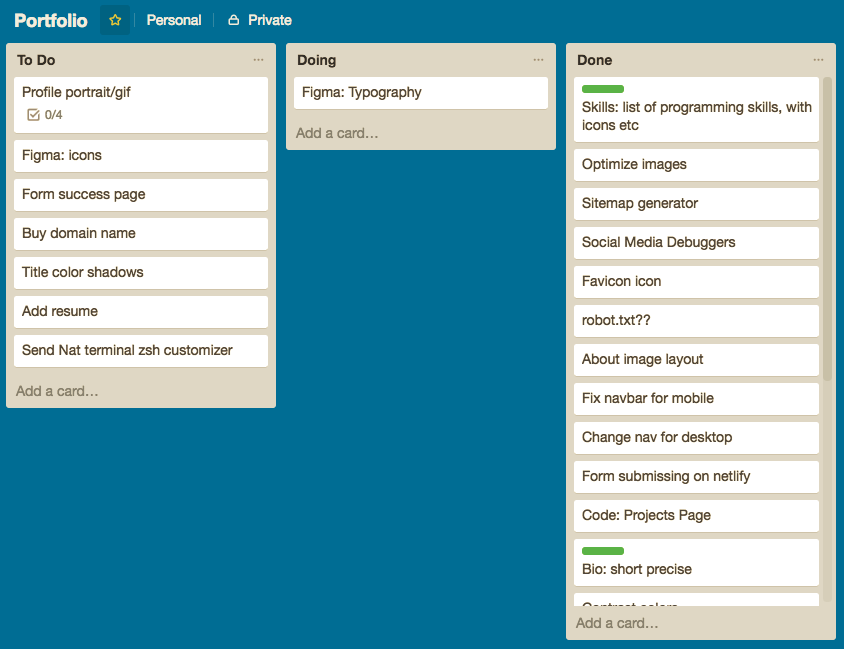

## Design 

### Mood board & Inspiration 

I used pinterest to find inspiration for my site style. I always loved the use of color in the Blade Runner movies so chose to replicate that in my site.
https://www.pinterest.com.au/markthomastice/portfolio/
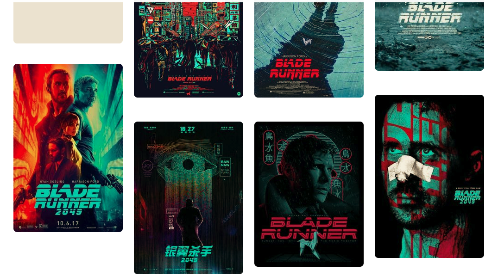

### Colors

My color scheme was achieved from extracting colors from my inspiration pictures. I then played around with what worked together in terms of contrast for the font and background.

### Typography 

I decided i wanted a simple and clean san serif font for the main content and then a simple yet playful font for main headers. After exploring what was available i settled on Audiowide for the headers, and Montserrat for the content.

- Headers 
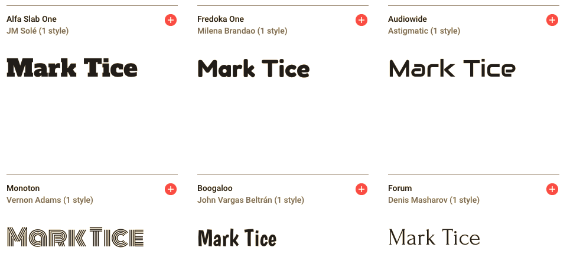
- Content 
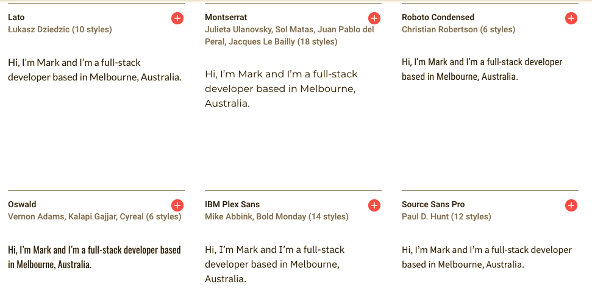
- Example 
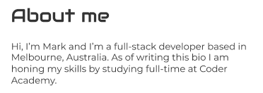

### Logo 

I tried several designs but kept coming to the conclusion that my name and face were what i wanted viewers to remember, not an inrelevant logo design.   
Therefore for my logo i simply went with my name in the main font, which is displayed front and center on my landing page, aswell as top left corner in the nav bar on large displays. I also added an animation on hover for extra effect.

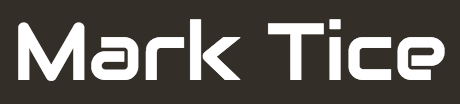

## Wireframes 

I found that although the contrast between the two main colors was strong, it was quite blinding when used for actual content. To combat this I decided to incorporate white and a dark grey for most of my content with the green color mixed in.

- View my full Figma here: https://www.figma.com/file/ZxlQ8AjN9M7vi6mOKHSyTmj0/Porfolio
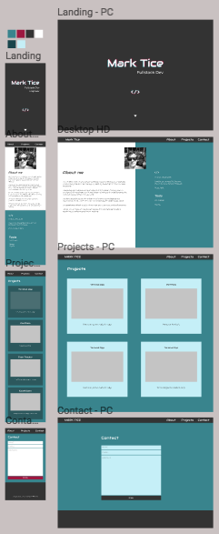

## 
 Coding 

A version of my MVP was created very early in the process before much effort was put into content creation or deep design. This can be seen from my early commits on github and also from my codepen progress. I wanted to assure i got the basic layout of the site nailed down early so i could continue to build parts of the site to assure what i wanted was actually achievable.

- What went well
  - The general layout and flow of the site. The colors contrast well. Typography looks good. Minimal design.
- What was challenging
  - media queries - changing to multiple columns and re-sizing everything on large displays. 
- What got changed
  - Background colors
  - My landing page seemed a bit too minimal and bland so i added some spacing and an inspirational quote, then added animation.
- Where to from here
  - personalized domain name
  - add projects i make throughout the course
    - make links to gihub, hover over effect (pop-out card)
  - use it to practice JavaScript (if practical)
  - include a blog
  - clean up code
  - optimize

### Animation 

I added some subtle animations to make some content stand out. I felt my landing page could use something add life to what is a rather simple page. To do this i used fade in for the quote and the left border to come in from the left. I also made an animation for the down button to beat so as to entice the user to press it.   
I also coded an animation for my name which i used on hover on the landing page and in the nav bar. A few other small animations are scattered accross the site.  
I implemented smooth scrolling for the nav bar id links very early on. I felt for a one page site this feature was very effective in enhancing the user experience.

## 
Tools 

### Sass 

I decided from the start that i would use this project to learn Sass. I'm very glad that i did as some of the features make organizing and understanding the flow your styling much easier to follow.

### Sitemap Generator 

I generated my sitemap using: https://www.xml-sitemaps.com/
I also used the tool to then validate the sitemap.
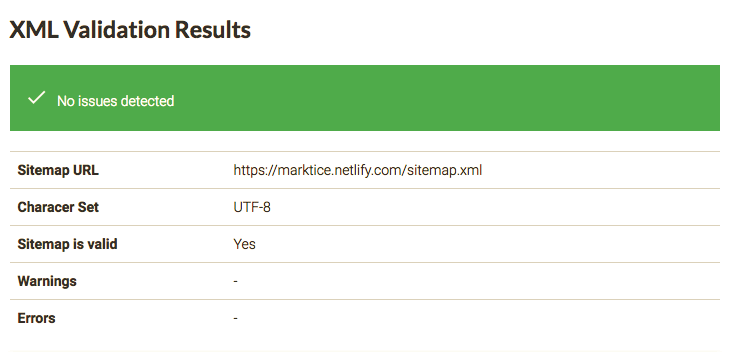

### Social Media Debuggers 

- The facebook debugger tool allowed me to test how my site looked when shared.
https://developers.facebook.com/tools/debug/
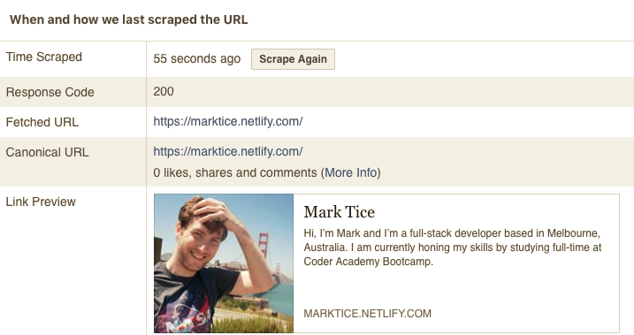

- Twitshot allowed me to test how my image for twitter came accross.
http://www.twitshot.com/
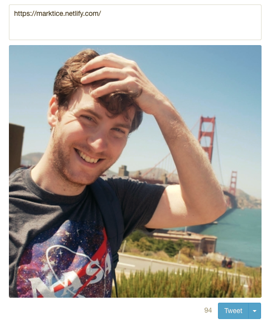

### Optimisation 

I optimized images using ImageOptim. This reduced file size of my images significantly.  https://imageoptim.com/

## Testing 

I used the pagespeed tester from google to evaluate my sites optimization. I achieved an average score which could be improved apon reducing the render-blocking css used and further optimizing and re-sizing images used.

https://developers.google.com/speed/pagespeed/insights/
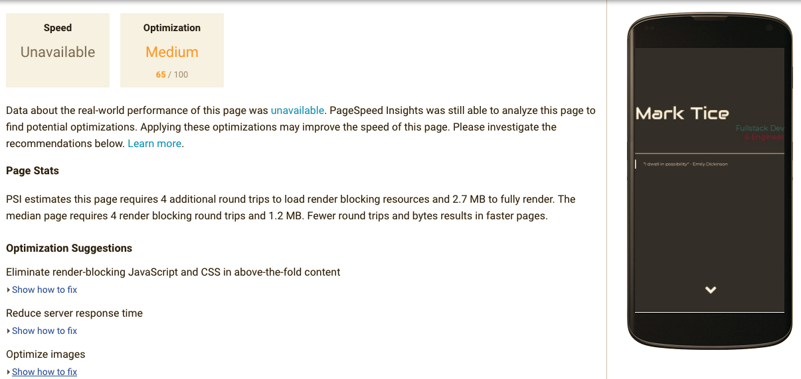

## Final Product 

Overall i am fairly happy with the 'final' product, however i do see many areas where i would like to improve and optimize the site in the future. 